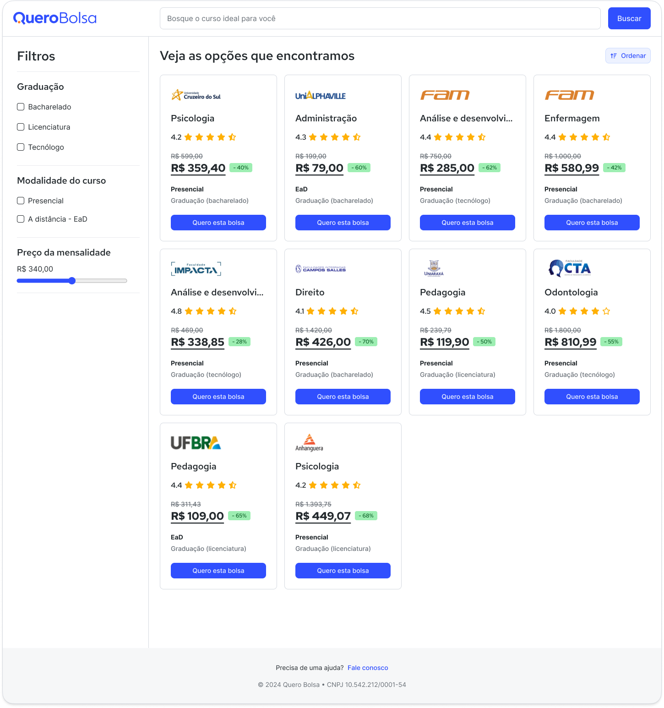

# 🖥️ Desafio de Front-End - Quero Educação 🚀

Bem-vindo(a) ao **Desafio de Front-End da Quero Educação**! 🎉  
Este desafio foi criado para avaliar suas habilidades em desenvolvimento, focando na implementação de funcionalidades e
ajustes de CSS. Está pronto(a)? Vamos lá! 👇

[](https://www.figma.com/design/kA2SnkvLXXCx0FBaj5eTz9/Teste-Front-End?node-id=2001-6193&m=dev)

---

## 📋 O Desafio

Seu objetivo é trabalhar em um projeto já iniciado, corrigindo detalhes de **CSS** e implementando funcionalidades em 
**JavaScript** com **Vue 3**. Abaixo estão as tarefas detalhadas:

### 🎨 CSS

- [ ] Ajustar o layout da página:
    - [ ] Fixar a sidebar na lateral esquerda da página 📏.
    - [ ] Definir a largura da sidebar em 220px 📏.
    - [ ] Ocultar a sidebar em telas menores 📱 _(abaixo de 1023px)_.
    - [ ] O conteúdo principal deve ocupar o espaço restante da largura da página 📏.
    - [ ] Realizar ajustes necessários no layout para otimizar a experiência do usuário 🎨.
- [ ] Ajustar a listagem de cards de ofertas:
    - [ ] Espaçamento de 16px entre os cards 📏.
    - [ ] Exibir 1 card por linha em telas pequenas 📱 _(até 639px)_.
    - [ ] Exibir 2 cards por linha em telas médias 📱 _(640px ~ 767px)_.
    - [ ] Exibir 3 cards por linha em telas grandes 📱 _(768px ~ 1023px)_.
    - [ ] Exibir 4 cards por linha em telas extra grandes 📱 _(1024px ~ 1535px)_.
    - [ ] Exibir 5 cards por linha em telas maiores 📱 _(1536px ou mais)_.

### 🛠️ JavaScript

- [ ] Realizar uma requisição para a API de ofertas e exibir os cards 📦  
  _(`GET http://localhost:3000/offers`)_
- [ ] Exibir corretamente os detalhes do card:
    - [ ] Tipo `presencial` como `Presencial` 🏫.
    - [ ] Tipo `ead` como `EaD` 🏠.
    - [ ] Nível `bacharelado` como `Graduação (bacharelado)` 🎓.
    - [ ] Nível `tecnologo` como `Graduação (tecnólogo)` 🎓.
    - [ ] Nível `licenciatura` como `Graduação (licenciatura)` 🎓.
    - [ ] Exibir estrelas conforme a propriedade `rating` 🌟.
    - [ ] Exibir meia estrela para valores fracionados de `rating` _(Ex: `4.9`)_.
    - [ ] Formatar os valores de `fullPrice` e `offeredPrice` como moeda 💰 _(Ex: `R$ 550,00`)_.
    - [ ] Calcular e exibir a porcentagem de desconto 📉.
    - [ ] Exibir a porcentagem de desconto no formato `27%` 📉.
- [ ] Implementar a busca de ofertas por nome:
    - [ ] A busca deve ser realizada nos dados em memória, sem nova requisição 🔄.
    - [ ] Busca **case-insensitive** 🔄.
    - [ ] A busca só ocorre ao pressionar o botão de busca 🔍.
- [ ] Implementar a ordenação de ofertas:
    - [ ] Ordenação pelo nome do curso 📝.
    - [ ] Ordenação por `offeredPrice` 📉.
    - [ ] Ordenação por `rating` 🌟.
- [ ] Implementar filtros de ofertas:
    - [ ] Filtro realizado nos dados em memória 🔄.
    - [ ] Filtrar por `level` 🎓.
    - [ ] Filtrar por `kind` 🏫.
    - [ ] Filtrar por `offeredPrice` com range 📉 _(exibir no formato `R$ 550,00`)_.
    - [ ] Permitir aplicar múltiplos filtros simultaneamente 📌.

O arquivo `server.json` não deve ser alterado. 🚫

---

## ⚙️ Tecnologias Utilizadas

Este projeto utiliza as seguintes tecnologias:

- **Vue 3** 🖥️
- **CSS (Tailwind opcional)** 🎨
- **TypeScript** 🧑‍💻

Fique à vontade para utilizar CSS puro ou Tailwind, de acordo com sua preferência. 🚀

---

## 📝 Instruções para Iniciar

1. Certifique-se de ter o **Node.js** na versão `20.x` ou superior.
2. Instale as dependências:
   ```bash
   npm install
   ```
3. Inicie o servidor de desenvolvimento:
   ```bash
   npm run dev
   ```
4. Acesse a aplicação em `http://localhost:3001`.
5. Acesse a API de ofertas em `http://localhost:3000/offers`.

---

## 🧑‍💻 Como Entregar

Ao finalizar o desafio, siga as instruções abaixo para enviar seu código:

### GitHub (Recomendado)

1. Crie um novo repositório no GitHub com as seguintes configurações:

- **Visibilidade**: Público.
- **Adicionar README**: Não.
- **Adicionar .gitignore**: Nenhum.
- **Escolher uma licença**: Nenhuma.

2. Atualize o `origin` para o novo repositório:
   ```bash
   git remote remove origin
   git remote add origin URL_DO_SEU_REPOSITORIO
   ```

3. Faça o commit das alterações:
   ```bash
   git add .
   git commit -m "Desafio de Front-End - Quero Educação"
   ```

4. Envie o código para o GitHub:
   ```bash
   git push origin main
   ```

5. Envie o link do repositório para: `recrutamento@quero.com`, identificando-se com seu nome completo.

### Google Drive

Caso prefira, envie o projeto compactado (`.zip`) via Google Drive para `recrutamento@quero.com`, com seu nome completo.

---

## 🔍 O que Avaliamos

Os critérios de avaliação incluem:

- Qualidade da solução 📈.
- Organização e legibilidade do código 🧑‍💻.
- Boas práticas de desenvolvimento 🚀.
- Aderência às instruções do desafio 📝.
- Apesar do typescript ser opcional, será um diferencial se for utilizado 📃.

---

## 💡 Dicas

O desafio foi pensado para ser desafiador, então não se preocupe em finalizar todas as tarefas. O importante é
demonstrar suas habilidades e raciocínio. 🚀

Dicas para organizar seu trabalho:

- Leia atentamente as instruções 📖.
- Entenda o código existente antes de começar 🧐.
- Concentre-se em uma tarefa por vez 🎯.
- Use as checkboxes para acompanhar seu progresso ✅.
- Sinta-se à vontade para começar as tarefas na ordem que preferir 🎨.

Boa sorte e bom código! 🎉
